<div align="center">


# Pulso

**A workout tracker for people who follow a plan.**
Build your training splits, run the session set by set, and watch the numbers move.

[**Live app →**](https://pulsoapp.pro/)

**No sign-up required.** Hit _Explore the demo account_ on the login screen — or use `demo@pulso.app` / `pulsodemo`.
It's a real account carrying 12 weeks of training history, rebuilt from scratch every day.


</div>

---

## Overview

Most gym apps either drown you in features or forget what you did last week. Pulso does one thing well: you define your **training splits** once, assign them to the days you train, and from then on the app knows what today's session is. During the workout you log every set, see your previous best on the same exercise, and get a rest timer between sets. Afterwards, all of it turns into charts — muscle balance, weekly frequency, volume, body weight.

It's a **full-stack TypeScript monorepo** (React + Express + PostgreSQL), installable as a **PWA** on phone and desktop, and fully bilingual (English / Portuguese) down to the exercise names, which are translated in the database.

<div align="center">

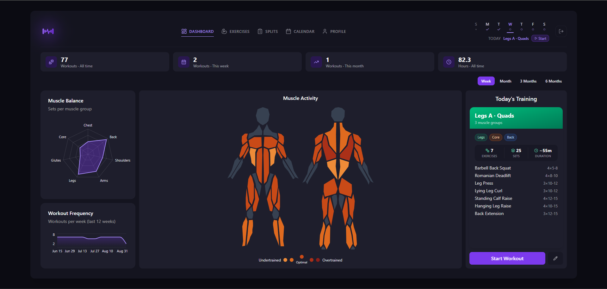

</div>

---

## Features

### Training splits & schedule

Create reusable splits (`Push A · Chest`, `Legs B · Glutes`), fill each one with exercises, sets and rep ranges, then assign them to weekdays — including rest days. The dashboard always surfaces **today's training** with a one-tap start.

### Calendar

- **Week view** — one card per day with the split, exercise and set counts, and the volume you actually logged
- **Month view** — the whole month as a grid, each day colored by its split and marked done, missed, rest or upcoming
- The view you pick is **remembered** for the next visit, and the side panel stats (sessions done / planned, volume, streak) follow the period you're looking at
- Tap a day to **open a finished session**, start today's workout, or swap the split assigned to that weekday

### Live workout session

<table>
<tr>
<td width="290">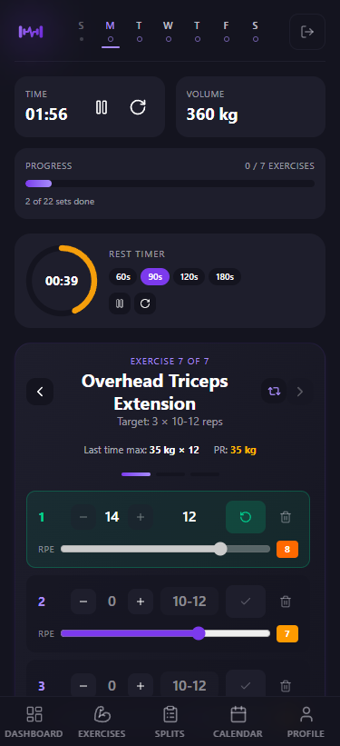</td>
<td valign="top">

The screen you actually use at the gym — one exercise at a time, everything else out of the way:

- **Set-by-set logging** with weight, reps and an RPE slider
- **Rest countdown** with 60 / 90 / 120 / 180s presets, pausable and resettable
- **Session stopwatch** and **live volume** as you log
- **Last time max** and your **personal record** on that exercise, right above the sets — so you always know the number to beat, and a toast fires when you beat it
- **Progress bar** across exercises and sets completed

The session **survives a refresh, a closed tab or a locked phone**: it's checkpointed to `localStorage` and restored when you come back. Leaving mid-workout asks for confirmation first.

</td>
</tr>
</table>

### Analytics

- **Muscle activity heatmap** rendered on a body model, from undertrained to overtrained
- **Muscle balance radar** — sets per muscle group, so you can see what you keep skipping
- **Workout frequency** over the last 12 weeks, **volume** and **streaks**
- **Per-exercise progression** charts and **body weight** tracking over time
- Every view filterable by week / month / 3 months / 6 months

### Platform

Installable **PWA** with an install prompt and an update toast when a new version ships · **English & Portuguese** UI, dates, numbers and exercise names · **kg / lb** unit preference · sign-up with **email verification code** · JWT auth · a seeded catalog of 118 exercises you can extend with your own.

<div align="center">

|                      Calendar · week                      |                      Calendar · month                       |
| :-------------------------------------------------------: | :---------------------------------------------------------: |
| 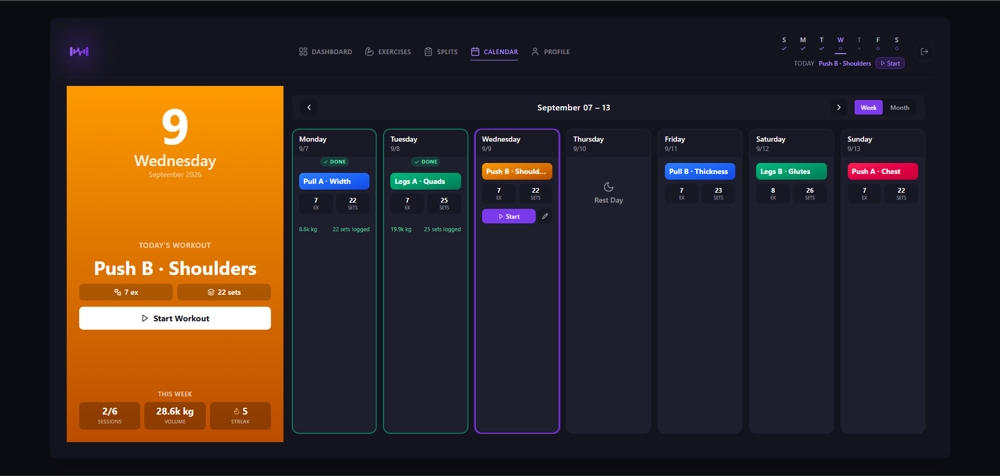 | 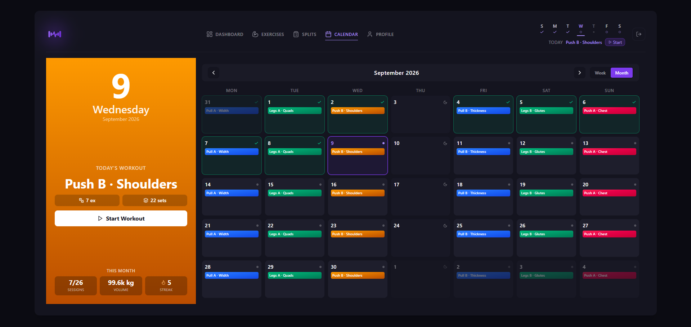 |
|                    **Training splits**                    |                    **Exercise library**                     |
|      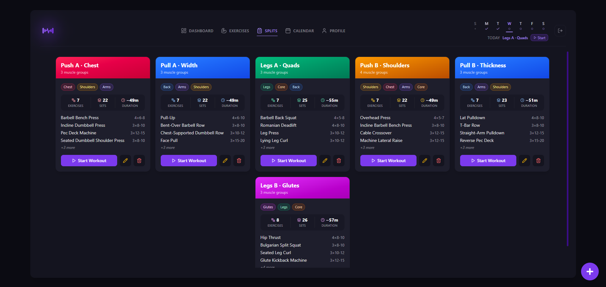      |        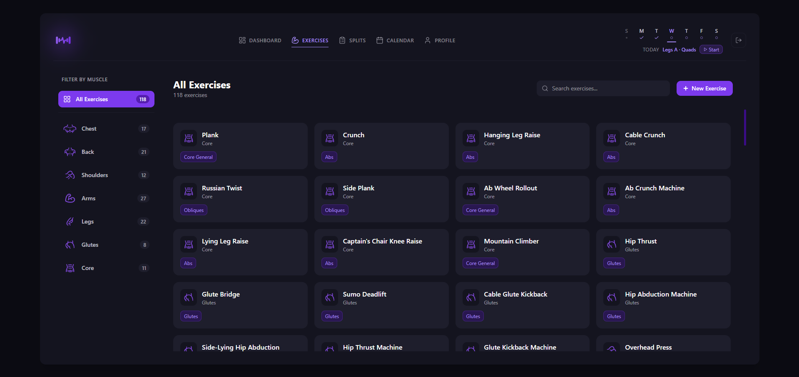         |
|                 **Profile & body weight**                 |                  **Live workout session**                   |
|         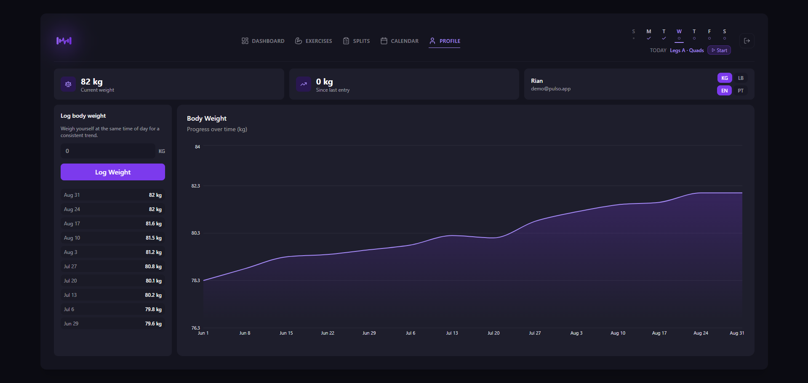          |    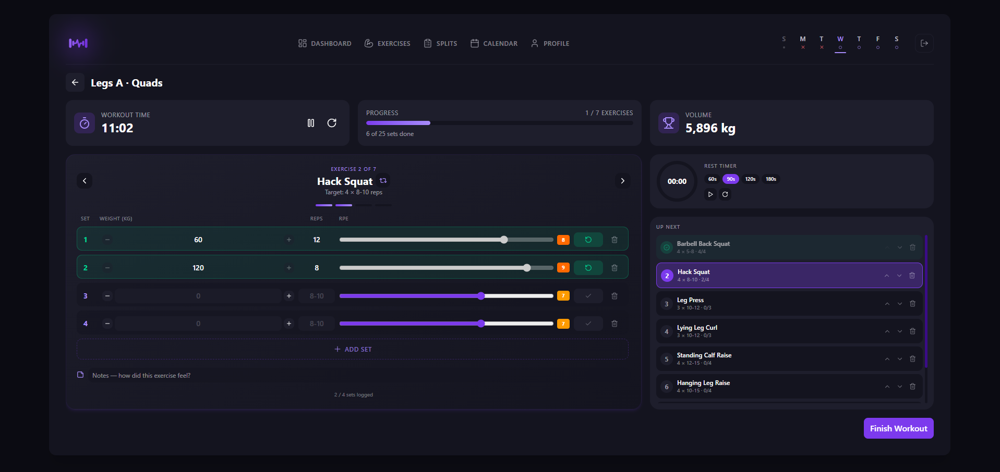    |

**Mobile**

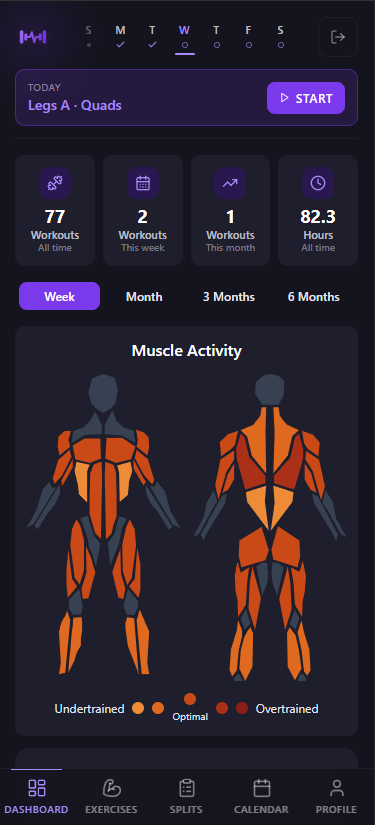
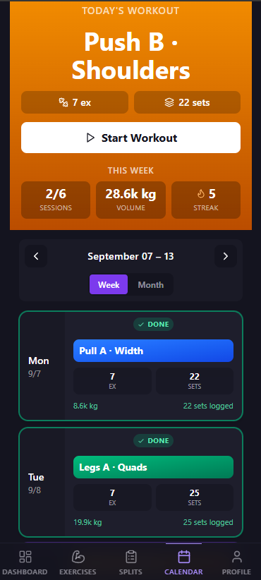
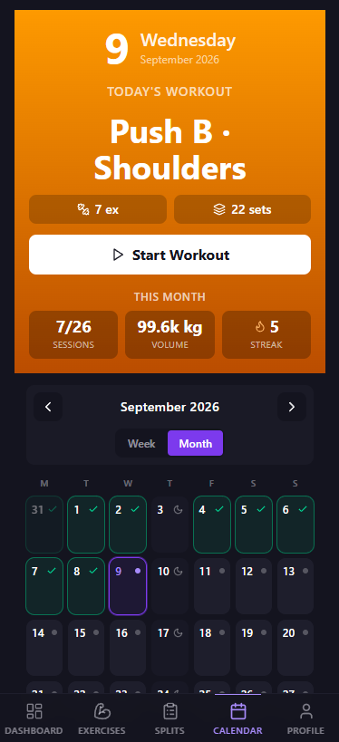
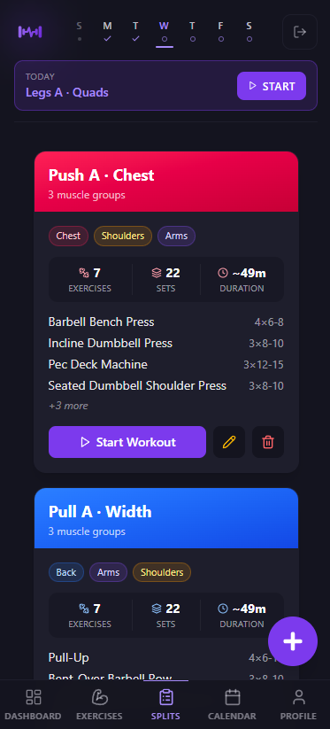

</div>

---

## Tech stack

| Layer        | Stack                                                                                                               |
| ------------ | ------------------------------------------------------------------------------------------------------------------- |
| **Frontend** | React 19, TypeScript, Vite 7, Tailwind CSS 4, Radix UI / shadcn, React Router 7, Recharts, Axios, `vite-plugin-pwa` |
| **Backend**  | Node 22, Express 5, TypeScript (ESM), Prisma 7, PostgreSQL, Zod, JWT, bcrypt, Nodemailer, `express-rate-limit`      |
| **Tooling**  | npm workspaces, ESLint 9, `tsx`, Prisma Migrate + seeds, `concurrently`                                             |

---

## Architecture

```
pulso/
├── apps/
│   ├── api/
│   │   ├── database/
│   │   │   ├── prisma/          # schema, migrations
│   │   │   ├── seeds/           # exercise catalog (en + pt)
│   │   │   └── server.ts        # entry point
│   │   └── src/
│   │       ├── modules/         # auth · user · exercises · training-splits
│   │       │                    # training-split-day · workout · body-weight · demo
│   │       └── shared/          # middlewares, config, services, utils
│   └── web/
│       └── src/
│           ├── api/             # typed HTTP clients, one per domain
│           ├── components/      # analytics · charts · workout · calendar · pwa · ui
│           ├── contexts/        # auth session
│           ├── dtos/            # shared request/response types
│           ├── hooks/           # useCountdown · useStopwatch · useLeaveGuard · usePwaInstall
│           ├── i18n/            # en/pt dictionaries, date & number formatting
│           ├── pages/           # route-level screens
│           └── utils/           # domain logic (PRs, volume, session persistence)
├── .github/workflows/           # daily demo-account reset
└── docs/
```

**The API is organised by domain, not by technical layer.** Each module owns the same four files — `router` → `controller` → `service` → `repository` — so a feature lives in one folder instead of being smeared across four. Routers wire middleware and Zod validation, controllers only translate HTTP, services hold the rules, repositories are the only code that touches Prisma. Business logic never sees a `Request` object, which keeps it trivial to move or test.

**The frontend mirrors that split.** Anything that computes rather than renders — personal records, session volume, streaks, restoring an interrupted workout — lives in `utils/` and `hooks/` as plain functions, so components stay about layout.

---

## Data model

```
users ──┬── training_splits ──┬── training_split_days      (which weekday it runs on)
        │                     └── training_split_exercises (exercise + sets + rep range)
        │
        ├── workout_sessions ──── workout_exercise_logs ──── workout_sets
        │                                                    (reps, weight, RPE)
        ├── exercises ──── exercise_translations             (per-locale title/description)
        └── body_weights

pending_registrations   (unverified sign-ups: hashed code, TTL, attempt counter)
```

Two details worth calling out:

- **Exercises are classified twice** — by `muscleGroup` (7 values, used for the radar and filters) and by a finer `muscle` enum (26 values, used for the heatmap). One lift can be _Chest_ for balance purposes and _Upper Chest_ for the heatmap.
- **Sessions outlive their split.** `workout_sessions.trainingSplitId` is `SET NULL` on delete, so deleting a split you no longer run never erases the history you built with it.

---

## Getting started

**Requirements:** Node ≥ 22, a PostgreSQL database, and a [Resend](https://resend.com) account with a verified domain for the verification emails (the free tier covers it).

```bash
git clone https://github.com/idkrian/fit.git pulso
cd pulso
npm install
```

**`apps/api/.env`**

| Variable                       | Description                                                                            |
| ------------------------------ | -------------------------------------------------------------------------------------- |
| `DATABASE_URL`                 | PostgreSQL connection string                                                           |
| `JWT_SECRET`                   | Secret used to sign auth tokens                                                        |
| `FRONTEND_URL`                 | Web app origin, used for CORS                                                          |
| `RESEND_API_KEY`               | Resend API key with sending access, used to deliver verification emails                |
| `EMAIL_FROM`                   | Sender address shown to users                                                          |
| `PORT`                         | API port (defaults to `3000`)                                                          |
| `TRUST_PROXY`                  | Proxy hops to trust — set to `1` behind a reverse proxy so rate limiting sees real IPs |
| `DEMO_EMAIL` / `DEMO_PASSWORD` | Optional. Credentials for the seeded demo account — leave empty to skip it entirely    |
| `DEMO_RESET_SECRET`            | Optional. Shared secret for `POST /demo/reset`; without it the route returns 404       |

**`apps/web/.env`**

| Variable                                 | Description                                                   |
| ---------------------------------------- | ------------------------------------------------------------- |
| `VITE_API_BASE`                          | Base URL of the API, e.g. `http://localhost:3000`             |
| `VITE_DEMO_EMAIL` / `VITE_DEMO_PASSWORD` | Optional. Shows the one-click demo button on the login screen |

Both apps ship a `.env.example` you can copy.

**Set up the database and run both apps:**

```bash
npm run build:api     # generates the Prisma client
npx prisma migrate dev --schema apps/api/database/prisma/schema.prisma
npm run dev           # API + web, in parallel
```

The web app runs on `http://localhost:5173`.

---

## Scripts

| Command                               | What it does                                                   |
| ------------------------------------- | -------------------------------------------------------------- |
| `npm run dev`                         | Runs API and web together with colour-coded logs               |
| `npm run dev:api` / `npm run dev:web` | Runs one side only                                             |
| `npm run build`                       | Builds both apps for production                                |
| `npm run start:api`                   | Applies migrations, seeds the exercise catalog, starts the API |
| `npm run lint`                        | Lints the web app                                              |

---

## Engineering highlights

- **Crash-safe workout sessions.** An in-progress workout is written to `localStorage` under a per-user, **versioned** key with a 6-hour TTL. On load, a snapshot from an older schema version or an abandoned session is discarded instead of being restored into a broken state — a migration path for client-side state.
- **Type-safe i18n with no library.** Dictionaries are plain TypeScript objects and translation keys are derived from their shape, so a typo is a compile error rather than a blank label. Missing keys fall back to English and warn in dev. Adds ~0 KB to the bundle.
- **Translation lives in the database, not the bundle.** `exercise_translations` resolves per-locale titles server-side from the `Accept-Language` header, so a user-created exercise and a seeded one are localised the same way.
- **Stats aggregate in PostgreSQL.** Muscle and muscle-group breakdowns are single grouped SQL queries scoped to the user and date window — the API returns a handful of rows instead of shipping months of sets to the browser to be reduced there.
- **Layered rate limiting on the auth flow.** Login, code verification and email dispatch each have their own limiter, and email dispatch is capped **per IP and per email address** — so one address can't be spammed with codes from many IPs, and one IP can't enumerate many addresses.
- **Verification codes are never stored in the clear.** Sign-ups sit in `pending_registrations` with a bcrypt-hashed code, an expiry and an attempt counter; the `users` row is only created once the code checks out.
- **PWA with a controlled update path.** The service worker registers with `prompt` rather than auto-reloading, so a new deploy shows a toast and never swaps the app out from under someone mid-set.
- **A demo account that can't go stale.** Every date in it is derived from `NOW()` at generation time rather than hardcoded, so the history always ends yesterday and today's session is always waiting to be started. It regenerates on each deploy and from a daily GitHub Actions cron, which also wipes whatever a visitor changed. A seeded PRNG drives the skipped days and rep variance, so the charts keep the same shape between runs instead of jumping around — and the generator is a pure function of the current date, testable without a database.

---

## License

MIT
